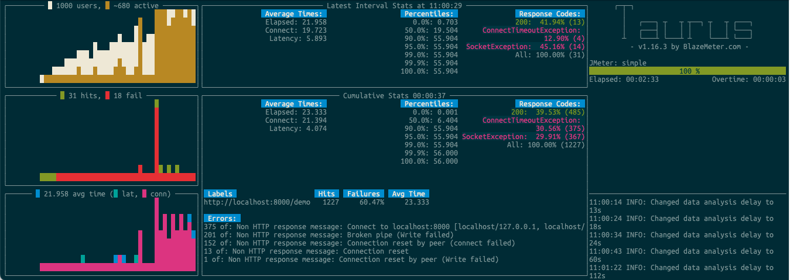

# Project Loom

[JEP 425: Virtual Threads (Preview)](https://openjdk.java.net/jeps/425) has been proposed recently. It has been a long-awaited feature in Java. 

I wanted to give it a try combined with the [JEP 408: Simple Http Server](https://openjdk.org/jeps/408) feature also recently added so I downloaded the [early release](https://jdk.java.net/loom/) of JDK which has the project loom in it. However, it is under preview. 

Looking for some playground for trying Project Loom, the "Simple Web Server" added in Java 18 is perfect for that; it's literally a single line of code for having it use Loom virtual threads.

```
server.setExecutor(Executors.newVirtualThreadPerTaskExecutor());
```

## Results

### with Project Loom and using Virtual Threads


```

10:56:44 INFO: Test duration: 0:02:34
10:56:44 INFO: Samples count: 59731, 14.89% failures
10:56:44 INFO: Average times: total 1.267, latency 1.170, connect 1.164
10:56:44 INFO: Percentiles:
+---------------+---------------+
| Percentile, % | Resp. Time, s |
+---------------+---------------+
|           0.0 |         0.005 |
|          50.0 |         0.124 |
|          90.0 |         3.604 |
|          95.0 |         6.844 |
|          99.0 |          19.6 |
|          99.9 |          26.0 |
|         100.0 |        26.272 |
+---------------+---------------+
10:56:44 INFO: Request label stats:
+----------------------------+--------+--------+--------+----------------------------------------------------------------------+
| label                      | status |   succ | avg_rt | error                                                                |
+----------------------------+--------+--------+--------+----------------------------------------------------------------------+
| http://localhost:8000/demo |  FAIL  | 85.11% |  1.267 | Non HTTP response message: Connection reset by peer (connect failed) |
|                            |        |        |        | Non HTTP response message: Connection reset                          |
|                            |        |        |        | Non HTTP response message: Broken pipe (Write failed)                |
+----------------------------+--------+--------+--------+----------------------------------------------------------------------+

```

### standard Java

```
11:03:16 INFO: Test duration: 0:03:18
11:03:16 INFO: Samples count: 4570, 59.78% failures
11:03:16 INFO: Average times: total 29.581, latency 6.731, connect 27.498
11:03:16 INFO: Percentiles:
+---------------+---------------+
| Percentile, % | Resp. Time, s |
+---------------+---------------+
|           0.0 |         0.001 |
|          50.0 |        31.184 |
|          90.0 |        55.904 |
|          95.0 |        55.904 |
|          99.0 |        55.904 |
|          99.9 |          56.0 |
|         100.0 |          56.0 |
+---------------+---------------+
11:03:16 INFO: Request label stats:
+----------------------------+--------+--------+--------+---------------------------------------------------------------------------------------------------------------------------------+
| label                      | status |   succ | avg_rt | error                                                                                                                           |
+----------------------------+--------+--------+--------+---------------------------------------------------------------------------------------------------------------------------------+
| http://localhost:8000/demo |  FAIL  | 40.22% | 29.581 | Non HTTP response message: Connection reset                                                                                     |
|                            |        |        |        | Non HTTP response message: Connect to localhost:8000 [localhost/127.0.0.1, localhost/0:0:0:0:0:0:0:1] failed: connect timed out |
|                            |        |        |        | Non HTTP response message: Connection reset by peer (Write failed)                                                              |
|                            |        |        |        | Non HTTP response message: Connection reset by peer (connect failed)                                                            |
|                            |        |        |        | Non HTTP response message: Broken pipe (Write failed)                                                                           |
+----------------------------+--------+--------+--------+---------------------------------------------------------------------------------------------------------------------------------+

```




## How to run this with IntelliJ Idea

Create a project and set up the JDK using the following window:


Then when I tried to run, it didn’t allow me to run the code since the virtual thread was still in preview. Here are the steps I had to go through in IntelliJ IDEA.

First, you need to go preference, and then **Build, Execution, Deployment** and then Select Java Compiler.


At the bottom, there is a box named the additional command line parameter. Add the following line there-

    --enable-preview

And then go to the run configuration. Select the modify options and Mark the Add VM options.

You need to add `--enable-preview` there as well.


Now you can run the project loom from IntelliJ IDEA.
